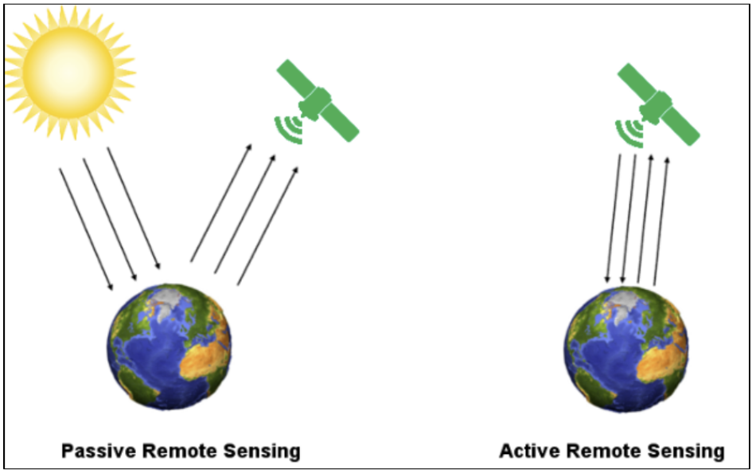
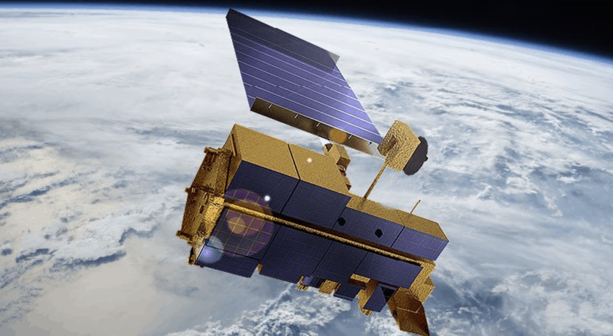

```{r xaringan-themer, include=FALSE, warning=FALSE}
library(xaringanthemer)
style_mono_accent(
  # #1c2653 #527060
  base_color = "#2A4D3A",
  header_font_google = google_font("Josefin Sans"),
  text_font_google   = google_font("Montserrat", "300", "300i"),
  code_font_google   = google_font("Fira Mono"),
)
```

```{r setup, include=FALSE}
options(htmltools.dir.version = FALSE)
```

```{css, echo=FALSE}
/* Changing the font size of each slide */

/* the title font size for each slide */
.remark-slide-content h1 {
  font-size: 42px; 
}

.remark-slide-content h2 {
  font-size: 36px; 
}

/*
.remark-slide-content h3 {
  font-size: 24px; */
}
```

```{r xaringan-all, echo=FALSE}
#xaringanExtra::use_scribble() #scribble drawing function, but too lag
xaringanExtra::use_search(show_icon = TRUE, auto_search	=FALSE) #search function
```

```{css, echo=FALSE}
/* Changing the font size of title slide */
.title-slide, .title-slide h1, .title-slide h2 {
  color: #2A4D3A; 
}

.title-slide h3 {
  color: #527060;
}

.title-slide h1 {
  font-size: 52px; 
}

.title-slide h2 {
  font-size: 36px; 
}

.title-slide h3 {
  font-size: 24px; 
}
```

```{css, echo=FALSE}
/* Using selected background image*/
.title-slide {
  background-image: url(images/Jakarta_satellite.PNG);
  background-position: 50% 50%;
  background-size: 100%;
}

/* Adding an white zone for decoration */
.title-slide::before {
  content: "";
  position: absolute;
  top: 10%; 
  left: 0%;
  width: 100%;
  height: 80%; 
  background-color: rgba(255, 255, 255, 0.7); 
  z-index: 1; /* Under the text */
}

/* Adding the dcorative icon backgrounde */
.title-slide::after {
  content: "";
  position: absolute;
  top: 10%; 
  left: 0;
  width: 100%; 
  height: 80%; 
  background-image: url(images/casalogobw.png); 
  background-size: 135%; 
  background-position: center; 
  z-index: 0; /* Under the text and white zone */
  opacity: 0.3; /* transparent */
}

/* let text is above all */
.title-slide > * {
  position: relative;
  z-index: 2;
}
```


# Introduction of Two types of sensors

* Active sensors have their own source of light or illumination. In particular, it actively sends a pulse and measures the backscatter reflected to the sensor.

* But passive sensors measure reflected sunlight emitted from the sun. When the sun shines, passive sensors measure this energy.



---


# Introduction to Remote Sensing and MODIS

* Remote sensing is a technology that allows observation of the Earth from a distance, primarily via satellites.

* The Moderate Resolution Imaging Spectroradiometer (MODIS) is a key instrument on NASA's Terra and Aqua satellites.

* Launched in 1999 (Terra) and 2002 (Aqua), MODIS monitors Earth's atmospheric, terrestrial, and oceanic processes.

* Its mission enhances our understanding of global dynamics and environmental changes.



  <div style="font-size: 14px;"> <!-- The image source font size -->
  Moderate Resolution Imaging Spectroradiometer (MODIS) Source: <a
  href="https://vajiramandravi.com/upsc-daily-current-affairs/prelims-pointers/moderate-resolution-imaging-spectroradiometer-modis/"
  style="color: #7910FF;">Originally from Civils & Green Urbanisation, Rooftop Greening in Mancity</a> <!-- Hyper color -->
  <!-- 额外图源记得写一下描述 -->
  </div>


---

# Technical Specifications and Capabilities


* MODIS captures data in 36 spectral bands, from visible to thermal infrared.

* It operates at three spatial resolutions: 250m, 500m, and 1km.

* The instrument covers the entire Earth's surface every 1 to 2 days.

* This frequent coverage provides consistent and comprehensive data streams for various scientific studies.
 
* MODIS's ability to capture detailed atmospheric features is critical for studying air quality, aerosol concentrations, and the dynamics of the Earth's atmosphere.

* The data from MODIS is freely accessible to the global research community, which facilitates a wide range of scientific studies and applications in environmental monitoring, agriculture, and climate science.


---


# Applications in Climate Change Studies

* MODIS plays a pivotal role in tracking sea level changes, which are critical indicators of climate change. By monitoring ocean temperatures and melting polar ice caps, MODIS data contribute to understanding sea level rise and its potential impacts on coastal communities.

* The instrument's detailed observations of the Earth's albedo, or reflectivity, help scientists understand how changes in snow and ice cover affect the planet's energy balance. This is crucial for modeling future climate scenarios and predicting global warming trends.

* MODIS data assists in the monitoring of phenological changes, observing how shifts in climate patterns affect the timing of natural events, such as plant flowering and migrations. These shifts can have cascading effects on ecosystems and biodiversity, highlighting the interconnectedness of climate change impacts.

* By providing accurate and timely data on atmospheric aerosol particles, MODIS aids in the study of their role in climate regulation. Aerosols can both cool the Earth's surface by reflecting sunlight back into space and contribute to warming through the greenhouse effect, making their monitoring essential for climate science.

---


# Applications in Disaster Management and Response

* MODIS's capability to provide accurate, near real-time imagery is vital for the rapid assessment of areas impacted by natural disasters, enabling more effective coordination of relief efforts and resource allocation.

* In wildfire scenarios, the instrument's data is essential for identifying the ignition points and monitoring the progression of fires over time, which aids in evacuating threatened areas and strategizing firefighting operations.

* For flood events, MODIS offers critical insights into the extent of water inundation, helping to identify vulnerable populations and infrastructure in need of urgent assistance, while also facilitating the strategic planning of flood defenses and mitigation strategies.

* The tool is instrumental in observing the aftermath of severe storms or hurricanes, offering early warnings and tracking systems that allow for timely evacuations and preparations, reducing potential harm to communities and infrastructure.


---


# Applications in Ecosystem Monitoring and Agriculture

* It enables precise tracking of phenological changes, such as flowering and harvest times, which are influenced by climate variations. This insight aids in adapting agricultural practices to shifting climate patterns.

* By analyzing vegetation indices, MODIS provides critical data on plant health across global ecosystems, guiding conservation efforts and land management decisions.

* The instrument's global coverage supports the detection of invasive species, offering early warnings that help in mitigating their impact on native ecosystems and agriculture.

* MODIS data informs sustainable forestry management by monitoring forest health, biomass, and changes due to logging or natural disturbances.

* It supports the monitoring of coastal ecosystems, assessing the health of mangroves, coral reefs, and other vital habitats affected by land use changes and climate effects.


---


# Reflections and Future Prospects

* Pivotal Role in Earth Observation: MODIS has become fundamental in environmental monitoring, offering critical insights into climate dynamics and supporting efficient disaster response.

* Advancement in Scientific Research: The data provided by MODIS have propelled scientific studies forward, helping to shape policy and promote environmental conservation on a global scale.

* Impact on Global Challenges: This instrument exemplifies the critical role of remote sensing in tackling global environmental and societal challenges, from climate change to natural disaster management.

* Technological Evolution and Future Missions: Anticipated advancements in satellite technology promise higher resolution, more accurate data, and broader spectral analysis capabilities.

* Enhanced Monitoring Capabilities: Future improvements will refine our understanding of the Earth, enabling more detailed and comprehensive observations of the planet's systems.

* Innovation in Data Analysis: The integration of emerging technologies, such as artificial intelligence and machine learning, with Earth observation data, is poised to revolutionize environmental monitoring and analysis.


---


# References

Bennett, K.D., and Zhao, X., 2023. 'Artificial Intelligence in Processing Remote Sensing Data: A Game Changer for Environmental Research', Technology and Environmental Science, vol. 12, no. 4, pp. 567-582.

Chang, Y., Kumar, A., and Li, D., 2024. 'Water Resource Management Using Satellite Remote Sensing: A Case Study with MODIS Data', Water Resources Management Journal, vol. 66, no. 8, pp. 1835-1852.

Davis, C.K., Wang, S., and Gomez, F., 2021. 'Remote Sensing in Disaster Management: A Review of Applications and Opportunities', International Journal of Disaster Risk Reduction, vol. 35, pp. 101289.

Johnson, L.M. and Thompson, H.R., 2023. 'Using MODIS Data to Enhance Climate Change Models and Predictions', Global Climate Review, vol. 47, no. 1, pp. 112-130.

Rodriguez, E. and Fernandez, L., 2022. 'Impact of MODIS on Monitoring Global Vegetation Health and Land Use Change', Journal of Agricultural and Environmental Sciences, vol. 39, no. 2, pp. 145-160.


---

class: inverse, center, middle

# Thank you!


